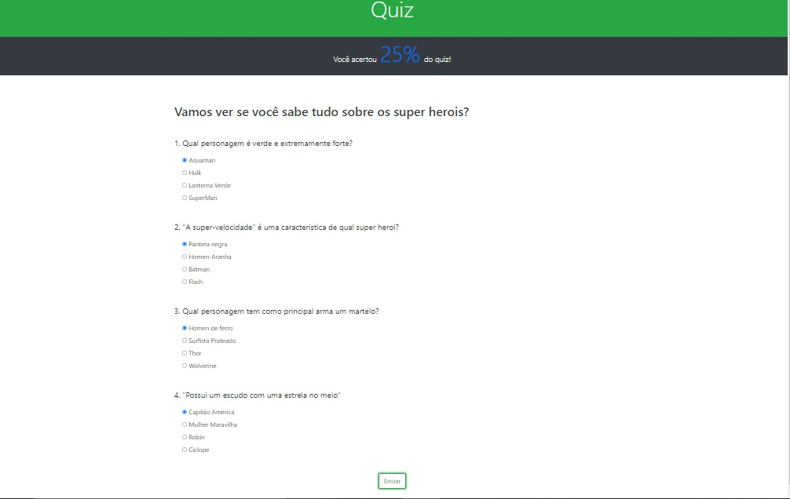

# Projeto Quiz desenvolvido durante o curso de javascript puro do CJRM - Roger Melo.

## Tecnologias utilizadas

- HTML5

- BootStrap

- JavaScript

🚀[Site do projeto](https://quiz-hero.netlify.app/)

